# Ecommerce Fullstack Project (API + WebApp) Deployment to AWS ECS

This project demonstrates the complete setup of a fullstack e-commerce application — composed of a **Node.js/Express API** and a **React WebApp** — containerized using **Docker** and deployed to **AWS ECS Fargate** using **GitHub Actions CI/CD**.

---

## 🗂️ Project Structure

```
├── api               # Node.js API (Express)
├── webapp            # React Web Application
├── .github
│   └── workflows
│       └── deploy.yml # GitHub Actions for CI/CD
└── README.md
```

---

## ✅ Prerequisites

Before you begin:

* AWS Account
* GitHub repository for your code
* Docker installed
* Node.js installed (v18+)
* AWS CLI configured locally (`aws configure`)

---

## ⚙️ Step 1: Local Development Setup

### 📦 API

```bash
cd api
npm install
npm run dev # or npm start
```

### 🌐 WebApp

```bash
cd webapp
npm install
npm start
```

---

## 🐳 Step 2: Dockerize Applications

### Dockerfile for `api/Dockerfile`

```Dockerfile
FROM node:18
WORKDIR /usr/src/app
COPY package*.json ./
RUN npm install
COPY . .
EXPOSE 3001
CMD ["npm", "start"]
```

### Dockerfile for `webapp/Dockerfile`

```Dockerfile
FROM node:18 as build
WORKDIR /app
COPY package*.json ./
RUN npm install
COPY . .
RUN npm run build

FROM nginx:alpine
COPY --from=build /app/build /usr/share/nginx/html
EXPOSE 80
```

Test locally:

```bash
docker build -t ecommerce-api ./api
docker build -t ecommerce-webapp ./webapp
```

---

## 🛠️ Step 3: Setup AWS Infrastructure

### 1. Create an **ECS Cluster**

* Name: `ecommerce-cluster`

### 2. Create **VPC** and subnets (or use default VPC)

### 3. Create **Security Group**

* Allow TCP on ports `3001` and `80`

### 4. Create **ECR Repositories**

```bash
aws ecr create-repository --repository-name ecommerce-api
aws ecr create-repository --repository-name ecommerce-webapp
```

### 5. Create **IAM Role** for ECS Tasks

* Name: `ecsTaskExecutionRole`
* Policy: `AmazonECSTaskExecutionRolePolicy`

### 6. Create **Fargate Services**

* Task Definitions for API and WebApp
* Configure to use `awsvpc` networking mode
* Add appropriate container port mappings
* Use previously created ECR image URI placeholders

---

## 🔐 Step 4: Configure GitHub Secrets

Go to GitHub repo → Settings → Secrets → Actions

| Secret Key              | Value                                                |
| ----------------------- | ---------------------------------------------------- |
| `AWS_ACCESS_KEY_ID`     | Your IAM Access Key                                  |
| `AWS_SECRET_ACCESS_KEY` | Your IAM Secret Key                                  |
| `AWS_REGION`            | e.g., `us-east-1`                                    |
| `ECR_REGISTRY`          | e.g., `123456789012.dkr.ecr.us-east-1.amazonaws.com` |
| `CLUSTER_NAME`          | `ecommerce-cluster`                                  |

---

## 🤖 Step 5: Setup GitHub Actions for CI/CD

### `.github/workflows/deploy.yml`

```yaml
# See main chat for full file structure
```

Also create these task definitions in the root:

* `ecs-api-task-def.json`
* `ecs-webapp-task-def.json`

Make sure they use the same container name and port as defined in AWS.

---

## 🚀 Step 6: Trigger Deployment

Push to `main` branch:

```bash
git add .
git commit -m "Deploy to ECS"
git push origin main
```

GitHub Actions will:

* Build Docker images
* Push to ECR
* Register new task definitions
* Update ECS services

---

## 📸 Screenshots

### ✅ Successful Workflow

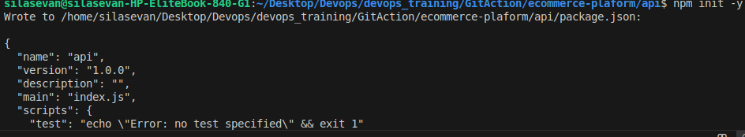
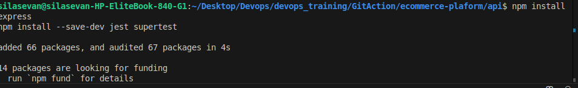
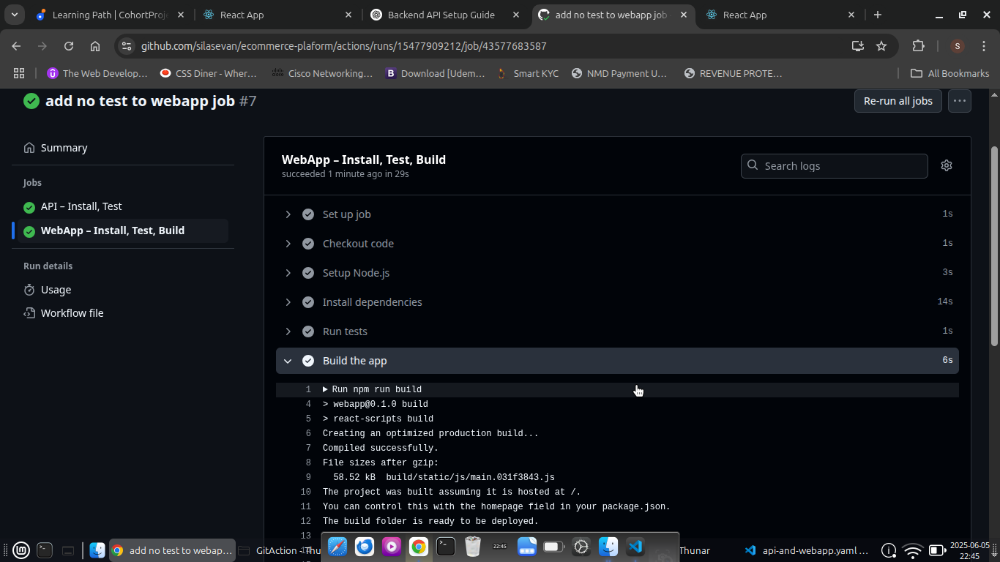
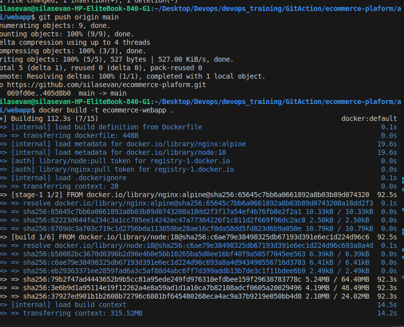
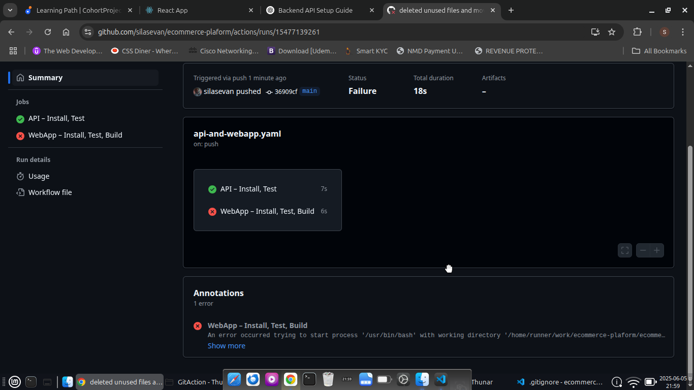
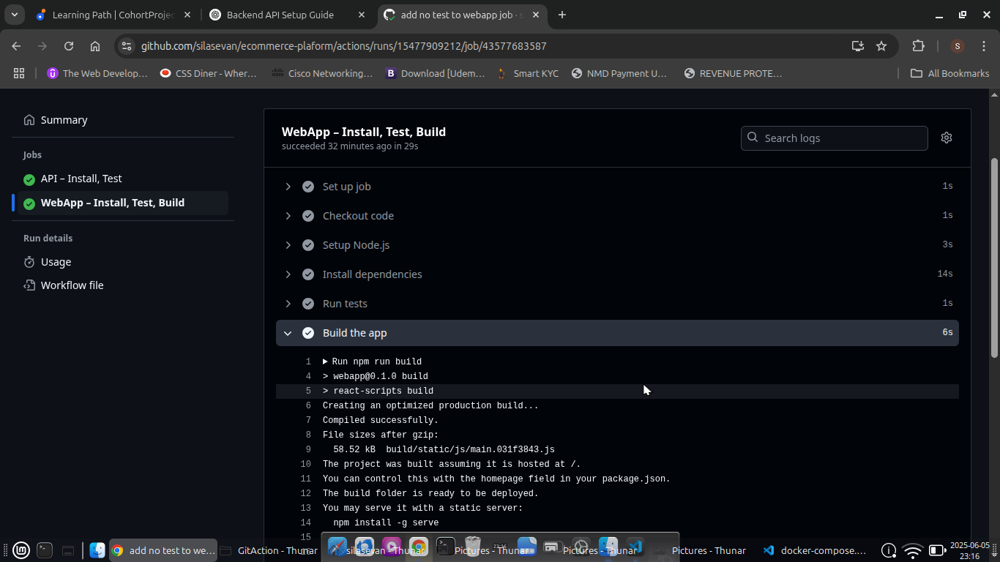
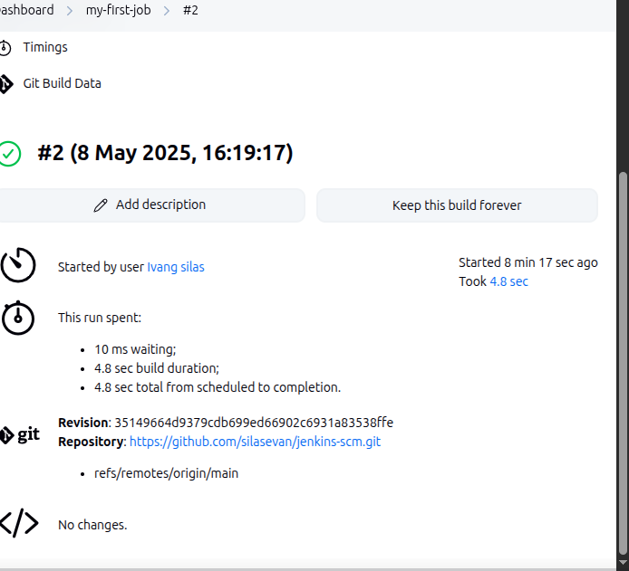
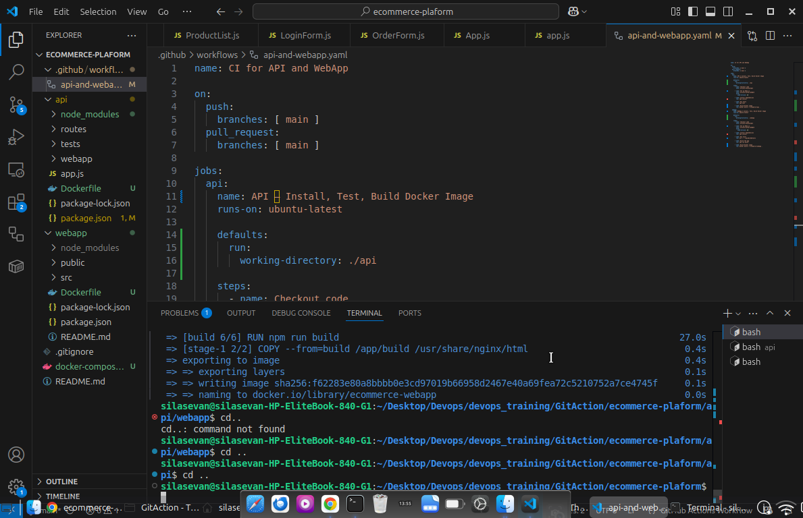
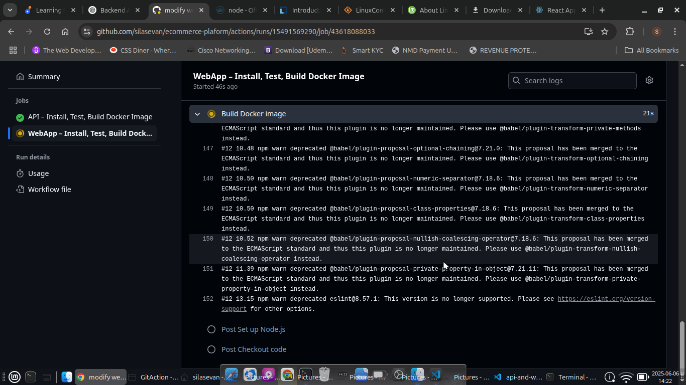
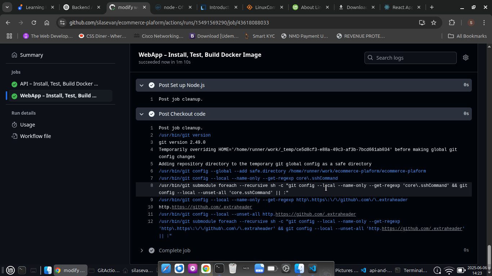


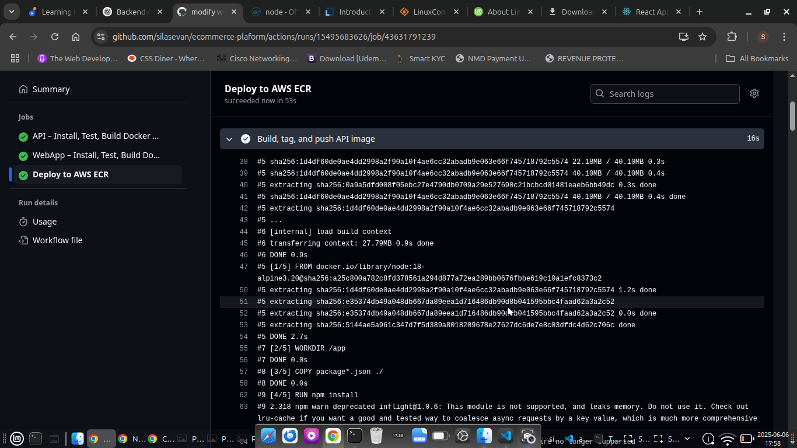
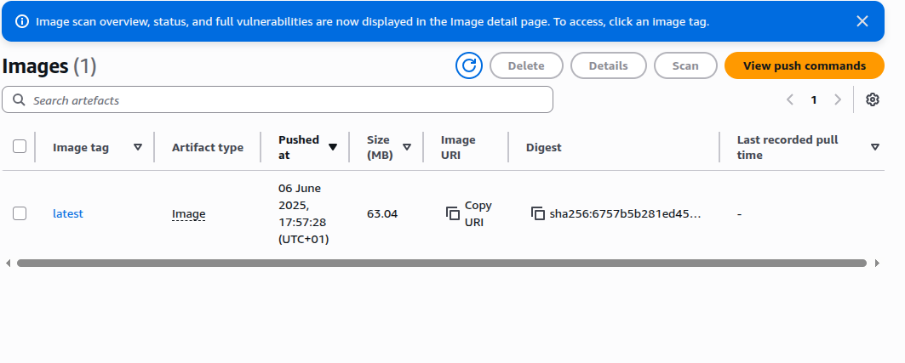

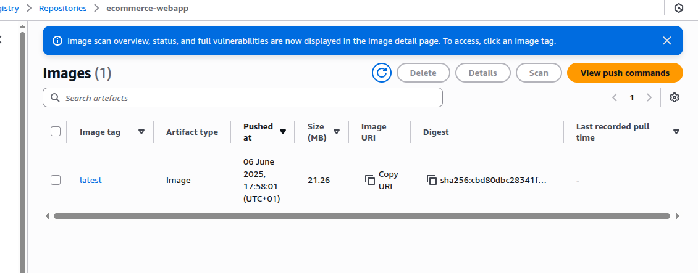
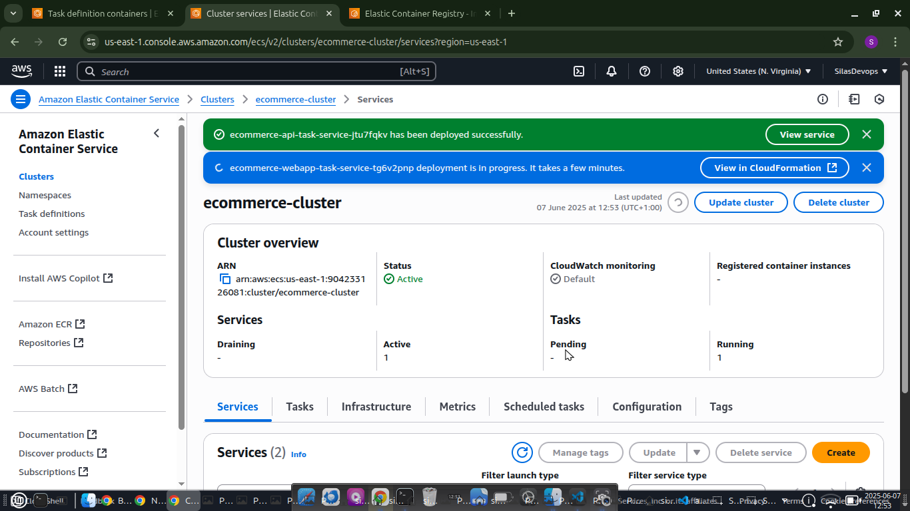
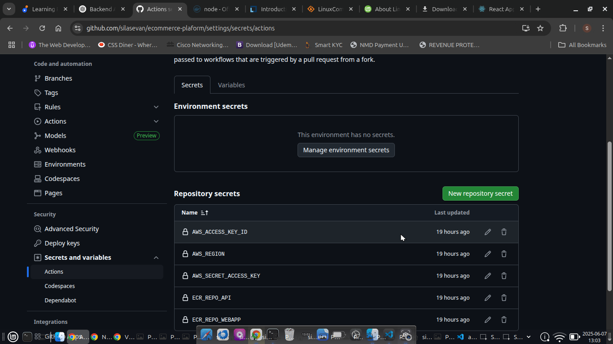
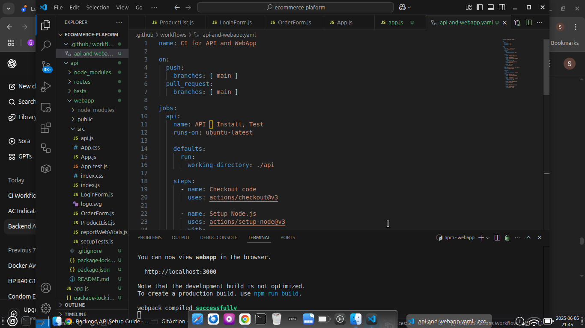


#
---

## 👏 Acknowledgements

* AWS ECS & Fargate Docs
* GitHub Actions team
* Docker & Node.js communities
